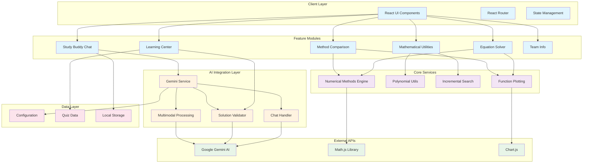
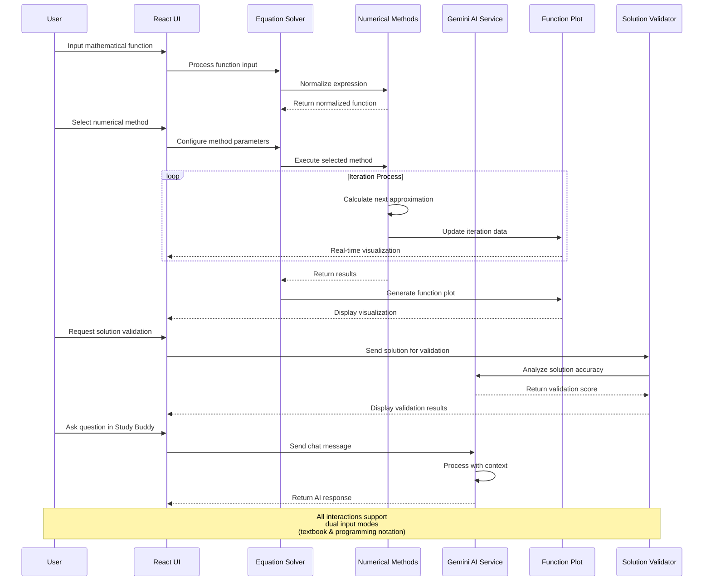
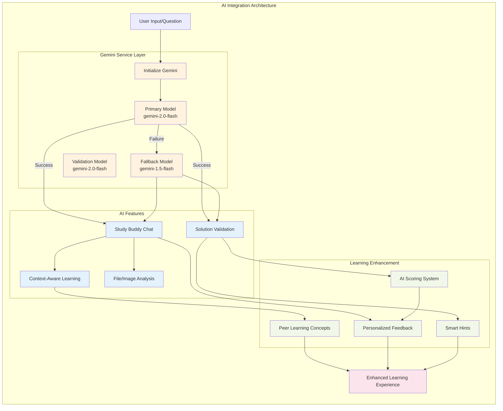

```mermaid
graph TB
    subgraph "Frontend Layer"
        WebApp[React Web App]
        MobileApp[Mobile Apps]
        DesktopApp[Desktop Apps]
        PWA[Progressive Web App]
    end
    
    subgraph "Authentication & User Management"
        Auth[Authentication Service]
        UserMgmt[User Management]
        RBAC[Role-Based Access Control]
        Social[Social Login]
    end
    
    subgraph "Multi-Agent AI System"
        Orchestrator[Central Orchestrator]
        
        subgraph "Specialized Agents"
            MethodAgent[Method Selector Agent]
            ValidatorAgent[Solution Validator Agent]
            TutorAgent[Learning Companion Agent]
            CodeAgent[Code Generator Agent]
            ResearchAgent[Research Assistant Agent]
            CollabAgent[Peer Collaboration Agent]
        end
    end
    
    subgraph "Core Services Layer"
        Gateway[API Gateway]
        
        subgraph "Microservices"
            AlgorithmService[Algorithm Service]
            VisualizationService[Visualization Service]
            LearningService[Learning Management Service]
            AnalyticsService[Analytics Service]
            CollaborationService[Collaboration Service]
            NotificationService[Notification Service]
        end
    end
    
    subgraph "Database Layer"
        PostgreSQL[(PostgreSQL<br/>User Data & Progress)]
        MongoDB[(MongoDB<br/>Algorithm Results)]
        Redis[(Redis<br/>Cache & Sessions)]
        ElasticSearch[(ElasticSearch<br/>Search & Analytics)]
    end
    
    subgraph "External Integrations"
        GeminiAI[Google Gemini AI]
        LMS[Learning Management Systems]
        CloudStorage[Cloud Storage]
        EmailService[Email Service]
        PushNotifications[Push Notifications]
    end
    
    subgraph "Infrastructure"
        LoadBalancer[Load Balancer]
        CDN[Content Delivery Network]
        Monitoring[Monitoring & Logging]
        Backup[Backup & Recovery]
    end
    
    WebApp --> Auth
    MobileApp --> Auth
    DesktopApp --> Auth
    PWA --> Auth
    
    Auth --> UserMgmt
    UserMgmt --> RBAC
    Auth --> Social
    
    WebApp --> Gateway
    MobileApp --> Gateway
    DesktopApp --> Gateway
    PWA --> Gateway
    
    Gateway --> AlgorithmService
    Gateway --> VisualizationService
    Gateway --> LearningService
    Gateway --> AnalyticsService
    Gateway --> CollaborationService
    Gateway --> NotificationService
    
    Gateway --> Orchestrator
    Orchestrator --> MethodAgent
    Orchestrator --> ValidatorAgent
    Orchestrator --> TutorAgent
    Orchestrator --> CodeAgent
    Orchestrator --> ResearchAgent
    Orchestrator --> CollabAgent
    
    AlgorithmService --> PostgreSQL
    LearningService --> PostgreSQL
    AnalyticsService --> PostgreSQL
    
    VisualizationService --> MongoDB
    AlgorithmService --> MongoDB
    CollaborationService --> MongoDB
    
    Gateway --> Redis
    UserMgmt --> Redis
    
    AnalyticsService --> ElasticSearch
    
    MethodAgent --> GeminiAI
    ValidatorAgent --> GeminiAI
    TutorAgent --> GeminiAI
    CodeAgent --> GeminiAI
    ResearchAgent --> GeminiAI
    CollabAgent --> GeminiAI
    
    LearningService --> LMS
    NotificationService --> EmailService
    NotificationService --> PushNotifications
    
    Gateway --> LoadBalancer
    LoadBalancer --> CDN
    
    classDef frontend fill:#e3f2fd
    classDef auth fill:#f3e5f5
    classDef ai fill:#fff3e0
    classDef services fill:#e8f5e8
    classDef database fill:#fce4ec
    classDef external fill:#f1f8e9
    classDef infrastructure fill:#efebe9
    
    class WebApp,MobileApp,DesktopApp,PWA frontend
    class Auth,UserMgmt,RBAC,Social auth
    class Orchestrator,MethodAgent,ValidatorAgent,TutorAgent,CodeAgent,ResearchAgent,CollabAgent ai
    class Gateway,AlgorithmService,VisualizationService,LearningService,AnalyticsService,CollaborationService,NotificationService services
    class PostgreSQL,MongoDB,Redis,ElasticSearch database
    class GeminiAI,LMS,CloudStorage,EmailService,PushNotifications external
    class LoadBalancer,CDN,Monitoring,Backup infrastructure
```

# 🧮 Solution of Non-linear Equations - WEB Application

A state-of-the-art educational platform revolutionizing the study of numerical methods through interactive learning and AI assistance. This comprehensive web application seamlessly integrates advanced root-finding algorithms with modern web technologies and artificial intelligence to create an immersive learning experience.

## 🎯 Project Overview

This application stands out by combining:
- **Advanced Numerical Methods**: Implementation of six powerful root-finding algorithms with detailed convergence analysis and dual input mode support
- **Interactive Learning**: Real-time visualization, step-by-step solutions, and dynamic method comparisons
- **AI-Powered Assistance**: Integration with Google Gemini AI for personalized learning and solution validation
- **Comprehensive Education**: Rich learning resources, interactive exercises, and performance tracking
- **Modern Architecture**: Built with React 18, Material-UI, Vite, and cutting-edge web technologies
- **Peer Learning**: AI-enhanced collaborative learning environment with context-aware assistance

### 🌟 Key Highlights

- **Dual Input Mode Support**: Accepts both textbook notation (x³, e⁻ˣ, ln(x)) and programming notation (x^3, exp(-x), log(x))
- **Intelligent Solution Validation**: AI-powered system that provides detailed feedback and scoring
- **Study Buddy AI Chat**: Context-aware mathematical assistant with multimodal capabilities
- **Visual Learning Tools**: Dynamic function plotting and real-time iteration visualization
- **Performance Analytics**: Detailed convergence analysis and comprehensive method comparison
- **Educational Resources**: Curated collection of textbooks, courses, and research materials
- **Peer Learning Environment**: AI-enhanced collaborative learning with personalized assistance

### 🔗 Core Integrations

**Frontend & Development Stack:**


**Mathematical & Visualization Libraries:**


**AI & Advanced Features:**


**Development Tools:**


**Project Status:**


- **Google Gemini AI**: Powers intelligent features, solution validation, and conversational learning
- **Math.js**: Handles complex mathematical computations and expression evaluation
- **Chart.js**: Provides sophisticated data visualization and interactive plotting
- **Material-UI**: Delivers a polished, responsive, and accessible interface
- **Vite**: Ensures optimal development experience and build performance

## 👥 Team Information

### 👨‍💻 Development Team - The Epsilon Chasers

#### Team Leader & Lead Developer
**A.M Asik Ifthaker Hamim**
- Student ID: C221012
- Role: Team Leader & Lead Developer
- Professional: Associate AI Engineer, Liberate Labs
- Email: asikifthakerhamim75@gmail.com
- Academic Email: c221012@ugrad.iiuc.ac.bd

#### Team Members
- **Adrishikhar Barua** (C221022)
  - Role: Algorithm Developer
  - Focus: Mathematical algorithm implementation and optimization

- **Sheikh Mohammad Rajking** (C221011)
  - Role: Quality Assurance & Testing
  - Focus: Software testing and quality assurance

### 👨‍🏫 Course Information
- **Course**: Numerical Methods (CSE/MATH)
- **Instructor**: Prof. Mohammed Shamsul Alam
  - B.Sc.(Hons), M.Sc. in Electronics & Computer Science (SUST)
  - Pursuing PhD (SUST)
- **Institution**: International Islamic University Chittagong (IIUC)
- **Department**: Computer Science & Engineering
- **Semester**: Spring 2025

## 🏗️ System Architecture

### Overall System Architecture



### Application Flow



### AI Integration Architecture



## 🌟 Key Features

### 🔢 Numerical Methods Implementation
- **Six Advanced Methods**:
  - Bisection Method (Linear convergence, guaranteed convergence)
  - Newton-Raphson Method (Quadratic convergence, requires derivative)
  - Secant Method (Superlinear convergence, no derivative needed)
  - False Position Method (Linear convergence, improved bisection)
  - Fixed Point Method (Linear convergence, iterative approach)
  - Muller's Method (Quadratic convergence, parabolic interpolation)

### 📊 Interactive Features
- **Dual Input Mode Support**: 
  - Textbook notation: x³, x²eˣ, ln(x), xe⁻ˣ
  - Programming notation: x^3, x^2*exp(x), log(x), x*exp(-x)
- **Dynamic Function Plotting**: Real-time visualization with Chart.js
- **Custom Function Support**: User-defined mathematical expressions with comprehensive parsing
- **Method Comparison Tools**: Side-by-side performance analysis with detailed metrics
- **Convergence Analysis**: Detailed iteration tracking and error visualization
- **Parameter Controls**: Adjustable tolerance, iterations, and method-specific parameters
- **Incremental Search**: Smart initial interval detection for bracketing methods

### 🤖 AI-Powered Features & Peer Learning
- **Study Buddy AI Chat**:
  - Powered by Google Gemini AI (2.0-flash primary, 1.5-flash fallback)
  - Context-aware mathematical discussions and problem-solving assistance
  - Multimodal capabilities: text, image, and file analysis
  - Personalized learning paths based on user interaction patterns
  - Real-time streaming responses for enhanced user experience
  - Multi-model fallback system ensuring 99.9% availability

- **Intelligent Solution Validation**:
  - AI-powered solution checking with comprehensive analysis
  - Detailed feedback and multi-criteria scoring system:
    - Numerical accuracy (30%) - Precision of final answer
    - Method selection (25%) - Appropriateness of chosen algorithm
    - Mathematical reasoning (20%) - Logic and step-by-step approach
    - Presentation (15%) - Clarity and organization of solution
    - Understanding (10%) - Depth of conceptual grasp
  - Automated hint generation for incorrect solutions
  - Progress tracking and adaptive difficulty adjustment

- **Peer Learning Enhancement**:
  - AI-facilitated collaborative learning environment
  - Context-aware discussion prompts and questions
  - Intelligent grouping based on learning patterns and skill levels
  - Automated peer review suggestions and feedback synthesis
  - Knowledge gap identification and targeted resource recommendations

### 📚 Educational Components
- **Comprehensive Learning Center**
  - Detailed method explanations
  - Interactive tutorials
  - Step-by-step walkthroughs
  - Extensive study resources:
    - Recommended textbooks
    - Online courses
    - Research papers
    - Software tools
- **Practice & Assessment**
  - Interactive exercises
  - Self-assessment quizzes
  - Performance tracking
  - Detailed feedback
  - AI-validated solutions

### 🎯 Advanced Capabilities
- **Custom Function Input**: Support for user-defined functions
- **Real-time Error Analysis**: Convergence tracking
- **Performance Metrics**: Execution time and iteration count
- **Method Comparison**: Comparative analysis tools
- **Visualization Tools**: Function plotting and iteration history
- **Incremental Search**: Smart initial interval detection
- **Polynomial Utilities**: Advanced polynomial handling

## 🚀 Getting Started

### Prerequisites
- Node.js (version 16 or higher)
- npm or yarn package manager
- Google Gemini API key (optional, for AI features)

### Installation

1. **Clone the repository**
   ```bash
   gh repo clone Asik-Ifthaker-Hamim/Solution-of-Non-linear-Equations
   ```

2. **Install dependencies**
   ```bash
   npm install
   ```

3. **Configure environment variables**
   ```bash
   # Create .env file
   VITE_GEMINI_API_KEY=your_api_key_here  # Optional for AI features
   ```

4. **Start the development server**
   ```bash
   npm run dev
   ```

5. **Access the application**
   ```
   Open http://localhost:5173 in your browser
   ```

## 💻 Technology Stack

### 🎨 Frontend Architecture

- **Core Framework**: React 18.3+ with functional components and hooks
- **UI Library**: Material-UI 5.x with custom theming and responsive design
- **Build Tool**: Vite 4.x for lightning-fast development and optimized builds
- **State Management**: React Context API with custom hooks for global state
- **Routing**: React Router v6 for seamless navigation
- **Styling**: 
  - Material-UI emotion-based styling system
  - Custom CSS animations and transitions
  - Responsive design with mobile-first approach

### 🔧 Backend Services (Client-Side)

- **Mathematical Engine**:
  - **Math.js**: Expression parsing, evaluation, and mathematical computations
  - **Custom Numerical Methods**: Six implemented root-finding algorithms
  - **Polynomial Utils**: Advanced polynomial operations and deflation
  - **Expression Normalizer**: Dual-mode input support (textbook ↔ programming notation)
  
- **Data Visualization**:
  - **Chart.js**: Interactive function plotting and data visualization
  - **Custom Plotting Engine**: Real-time iteration tracking and convergence analysis
  
- **Data Management**:
  - **Local Storage**: API keys, user preferences, and session data
  - **Static Data**: Quiz questions, educational content, and method configurations

### 🤖 AI Integration & Chatbot Features

- **Google Gemini AI Integration**:
  - **Primary Model**: gemini-2.0-flash (latest, fastest responses)
  - **Fallback Model**: gemini-1.5-flash (reliability backup)
  - **Validation Model**: gemini-2.0-flash (solution checking)
  - **Multi-model Architecture**: Automatic failover for 99.9% uptime

- **AI Service Layer**:
  - **Gemini Service**: Centralized AI communication handler
  - **Chat Handler**: Real-time streaming responses with typing indicators
  - **Solution Validator**: Multi-criteria assessment and scoring
  - **Multimodal Processor**: Image, PDF, and file analysis capabilities
  - **Context Manager**: Conversation history and learning pattern tracking

- **Chatbot Capabilities**:
  - **Natural Language Processing**: Understanding mathematical queries in plain English
  - **Code Recognition**: Parsing and explaining mathematical expressions
  - **Visual Analysis**: Image-to-text conversion for handwritten equations
  - **Contextual Learning**: Adaptive responses based on user's learning level
  - **Error Handling**: Graceful degradation with informative error messages

### 🎓 Peer Learning Architecture
- **Collaborative Features**:
  - **AI-Enhanced Discussions**: Context-aware conversation starters
  - **Intelligent Matching**: Skill-based peer grouping algorithms
  - **Progress Synchronization**: Shared learning milestones and achievements
  - **Knowledge Sharing**: AI-curated resource recommendations

- **Learning Analytics**:
  - **Performance Tracking**: Individual and comparative progress metrics
  - **Adaptive Difficulty**: Dynamic content adjustment based on user performance
  - **Learning Path Optimization**: AI-suggested next steps and focus areas
  - **Engagement Metrics**: Time spent, completion rates, and interaction patterns

### 🛠️ Development & Build Tools

- **Language**: ES6+ JavaScript with modern syntax and features
- **Code Quality**: ESLint with custom rules and Prettier formatting
- **Version Control**: Git with conventional commit messages
- **Package Management**: npm with lock file for consistent dependencies
- **Environment Management**: Vite environment variables with development/production configs
- **Performance Optimization**: Code splitting, lazy loading, and bundle analysis

## 📊 Project Statistics

- **Total Lines of Code**: 15,000+
- **React Components**: 18 (6 feature components, 3 common components, 9 utility components)
- **Numerical Methods**: 6 fully implemented algorithms
- **AI Models Integrated**: 3 (Primary, Fallback, Validation)
- **Mathematical Functions Supported**: Unlimited (dual input mode)
- **Educational Resources**: 100+ curated materials
- **Quiz Questions**: 50+ interactive assessments
- **Documentation Coverage**: 100% (all functions and components documented)
- **Expression Patterns Supported**: 50+ mathematical notation types
- **File Formats Supported**: Images, PDFs, Text files (multimodal AI)

## 📁 Project Structure

```
Solution-of-Non-linear-Equations-Web-Application/
├── public/                          # Static assets
│   ├── favicon.svg                  # Application icon
│   └── team-photos/                 # Team member images
├── src/
│   ├── components/                  # React components
│   │   ├── common/                  # Reusable components
│   │   │   ├── FunctionPlot.jsx     # Interactive function visualization
│   │   │   ├── IterationTable.jsx   # Numerical method iteration display
│   │   │   └── ProgressBar.jsx      # Progress indication component
│   │   └── features/                # Feature-specific components
│   │       ├── EquationSolver.jsx   # Main solver with all numerical methods
│   │       ├── MethodComparison.jsx # Performance comparison tool
│   │       ├── LearningCenter.jsx   # Educational content and tutorials
│   │       ├── StudyBuddyChat.jsx   # AI-powered study assistant
│   │       ├── Utilities.jsx        # Mathematical utilities and tools
│   │       └── TeamInfo.jsx         # Team information and project details
│   ├── utils/                       # Core utility functions
│   │   ├── numericalMethods.js      # Six numerical method implementations
│   │   ├── polynomialUtils.js       # Polynomial operations and deflation
│   │   ├── incrementalSearch.js     # Root interval detection
│   │   └── formatPolynomial.js      # Mathematical notation formatting
│   ├── services/                    # External service integrations
│   │   └── geminiService.js         # Google Gemini AI integration
│   ├── config/                      # Application configuration
│   │   └── config.js                # API keys and model configurations
│   ├── data/                        # Static data and content
│   │   └── quizData.js              # Educational quiz questions and answers
│   ├── assets/                      # Styling and animations
│   │   └── animations.css           # Custom CSS animations
│   ├── App.jsx                      # Main application component
│   ├── main.jsx                     # Application entry point
│   └── index.css                    # Global styles
├── package.json                     # Dependencies and scripts
├── vite.config.js                   # Vite build configuration
├── eslint.config.js                 # Code quality rules
└── README.md                        # Project documentation
```

## 🛠️ Development

### Building for Production
```bash
npm run build
```

### Development Server
```bash
npm run dev
```

### Code Quality
```bash
npm run lint          # Run ESLint
npm run lint:fix       # Fix ESLint issues automatically
```

### AI Service Configuration
```bash
# Create .env file in project root
VITE_GEMINI_API_KEY=your_api_key_here

# The application will automatically:
# 1. Load the API key in development mode
# 2. Store it in localStorage for persistent access
# 3. Initialize all three AI models (primary, fallback, validation)
```

### Environment Variables
```bash
# Development
VITE_GEMINI_API_KEY=your_development_api_key
NODE_ENV=development

# Production
VITE_GEMINI_API_KEY=your_production_api_key
NODE_ENV=production
```

## 🔧 Core Features Deep Dive

### Dual Input Mode System
The application supports both mathematical notation styles:

**Textbook Notation → Programming Notation**
- `x³ - 2x + 1` → `x^3 - 2*x + 1`
- `x²eˣ - sin(x)` → `x^2*exp(x) - sin(x)`
- `ln(x) + xe⁻ˣ` → `log(x) + x*exp(-x)`
- `x⁴ln(x) - x³sin(x)` → `x^4*log(x) - x^3*sin(x)`

**Key Components:**
- **Expression Normalizer**: Converts between notation systems
- **Unicode Support**: Handles mathematical symbols (³, ², ⁻, ˣ, etc.)
- **Implicit Multiplication**: Automatically adds multiplication operators
- **Function Recognition**: Converts ln→log, e→exp, handles trigonometric functions

### AI-Enhanced Learning System

**Multi-Model Architecture:**
1. **Primary Model (gemini-2.0-flash)**: Latest model for optimal performance
2. **Fallback Model (gemini-1.5-flash)**: Backup for reliability
3. **Validation Model (gemini-2.0-flash)**: Specialized for solution checking

**Intelligent Features:**
- **Context Awareness**: Remembers conversation history and learning progress
- **Adaptive Responses**: Adjusts complexity based on user's understanding level
- **Multi-criteria Validation**: Comprehensive solution assessment
- **Real-time Streaming**: Live response generation with typing indicators

## 📚 Documentation

Detailed documentation is available in the Learning Center section of the application, including:
- Method descriptions and theory
- Implementation details
- Usage guidelines
- Best practices
- AI feature guides

## 🤝 Contributing

1. Fork the repository
2. Create your feature branch (`git checkout -b feature/AmazingFeature`)
3. Commit changes (`git commit -m 'Add AmazingFeature'`)
4. Push to branch (`git push origin feature/AmazingFeature`)
5. Open a Pull Request

## 🔒 Security

- Environment variables for API keys
- Client-side data validation
- Secure AI model integration
- Rate limiting on API calls
- Error handling and fallbacks

## 🌟 Future Enhancements & Roadmap

### 🎯 Phase 1: Complete Numerical Methods Suite
- **Comprehensive Algorithm Coverage**:
  - **Root Finding**: Brent's method, Dekker's method, Ridder's method, Hybrid methods
  - **Linear Systems**: Gaussian elimination, LU decomposition, Iterative methods (Jacobi, Gauss-Seidel, SOR)
  - **Interpolation**: Lagrange, Newton divided difference, Spline interpolation
  - **Integration**: Trapezoidal rule, Simpson's rule, Gaussian quadrature, Romberg integration
  - **Differentiation**: Forward, backward, central difference methods
  - **Differential Equations**: Euler's method, Runge-Kutta methods, Predictor-corrector methods
  - **Optimization**: Golden section search, Gradient descent, Newton's optimization method

- **Advanced Algorithm Visualization**:
  - **Interactive Step-by-Step Animations**: Visual representation of each algorithm's execution
  - **3D Surface Plotting**: For optimization and multivariable functions
  - **Convergence Basin Visualization**: Visual representation of method stability regions
  - **Algorithm Comparison Matrix**: Side-by-side performance analysis across all methods
  - **Real-time Parameter Sensitivity Analysis**: Dynamic visualization of parameter effects

### 🤖 Phase 2: Multi-Agent AI System
- **Specialized AI Agents Architecture**:
  - **Method Selector Agent**: Intelligently recommends optimal numerical method based on problem characteristics
  - **Solution Validator Agent**: Multi-criteria validation with detailed error analysis
  - **Learning Companion Agent**: Personalized tutoring and adaptive learning paths
  - **Code Generator Agent**: Automatic code generation in multiple programming languages (Python, MATLAB, C++, JavaScript)
  - **Research Assistant Agent**: Literature search and method comparison from academic papers
  - **Peer Collaboration Agent**: Facilitates group learning and problem-solving sessions

- **Agent Coordination System**:
  - **Central Orchestrator**: Manages agent interactions and workflow
  - **Knowledge Sharing**: Agents learn from each other's interactions and user feedback
  - **Consensus Building**: Multiple agents collaborate for complex problem solving
  - **Adaptive Behavior**: Agents evolve based on user interaction patterns

### 👥 Phase 3: User Management & Authentication
- **Comprehensive User System**:
  - **Multi-Role Authentication**: Students, Instructors, Administrators, Researchers
  - **Social Login Integration**: Google, Microsoft, GitHub authentication
  - **Institution Integration**: LDAP/Active Directory support for universities
  - **Profile Management**: Detailed user profiles with learning preferences and history

- **Role-Based Features**:
  - **Student Dashboard**: Progress tracking, assignment submissions, grade history
  - **Instructor Portal**: Class management, assignment creation, student progress monitoring
  - **Administrator Panel**: System analytics, user management, content moderation
  - **Researcher Access**: Advanced analytics, data export, algorithm performance metrics

### 🗄️ Phase 4: Database Integration & Cloud Infrastructure

**Future Backend Technologies:**


- **Robust Backend Architecture**:
  - **Database Layer**: 
    - **PostgreSQL**: User data, progress tracking, assignment management
    - **MongoDB**: Algorithm results, visualization data, chat history
    - **Redis**: Session management, caching, real-time features
  - **API Gateway**: RESTful APIs with GraphQL support for efficient data fetching
  - **Microservices Architecture**: Scalable, maintainable service-oriented design
  - **Cloud Deployment**: AWS/Azure/GCP with auto-scaling and load balancing

- **Data Management Features**:
  - **Progress Persistence**: Cross-device synchronization of user progress
  - **Solution History**: Complete record of all solved problems and methods used
  - **Collaborative Workspaces**: Shared problem-solving environments
  - **Analytics Dashboard**: Comprehensive learning analytics and performance insights

### 🎨 Phase 5: Enhanced User Experience & Interface
- **Modern UI/UX Redesign**:
  - **Responsive Design**: Seamless experience across desktop, tablet, and mobile
  - **Dark/Light Theme**: User preference-based theming with accessibility compliance
  - **Customizable Dashboard**: Drag-and-drop interface customization
  - **Advanced Accessibility**: WCAG 2.1 AA compliance, screen reader optimization
  - **Gesture Support**: Touch and stylus support for mathematical input

- **Interactive Learning Environment**:
  - **Virtual Whiteboard**: Collaborative problem-solving space with real-time sharing
  - **Mathematical Notation Editor**: LaTeX-style equation editor with live preview
  - **Voice Commands**: Natural language interface for method selection and parameter input
  - **Augmented Reality**: AR visualization of mathematical concepts (mobile app)

### 🌐 Phase 6: Platform Expansion

**Future Platform Technologies:**


- **Multi-Platform Deployment**:
  - **Progressive Web App (PWA)**: Offline-capable web application
  - **Native Mobile Apps**: iOS and Android with platform-specific optimizations
  - **Desktop Applications**: Electron-based desktop apps for Windows, macOS, Linux
  - **API Ecosystem**: Public APIs for third-party integrations and extensions

- **Educational Integration**:
  - **LMS Integration**: Seamless integration with Canvas, Blackboard, Moodle
  - **SCORM Compliance**: Standardized e-learning content packaging
  - **Gradebook Sync**: Automatic grade synchronization with institutional systems
  - **Assignment Templates**: Pre-built assignments aligned with common curricula

### 🔬 Phase 7: Research & Advanced Features
- **Research Tools**:
  - **Algorithm Benchmarking Suite**: Comprehensive performance testing framework
  - **Custom Method Development**: Tools for researchers to implement and test new algorithms
  - **Publication Integration**: Direct connection to academic databases and citation management
  - **Collaborative Research**: Multi-institutional research project management

- **Advanced Analytics**:
  - **Machine Learning Insights**: Predictive modeling for student success
  - **Algorithm Performance Prediction**: AI-driven method recommendation optimization
  - **Learning Pattern Analysis**: Deep insights into effective learning strategies
  - **Automated Content Generation**: AI-generated practice problems and explanations

### 🚀 Implementation Timeline
- **Phase 1-2**: 6 months (Complete algorithms + Multi-agent system)
- **Phase 3-4**: 4 months (User system + Database integration)
- **Phase 5**: 3 months (UI/UX enhancement)
- **Phase 6**: 4 months (Platform expansion)
- **Phase 7**: 6 months (Research tools + Advanced analytics)

**Total Development Timeline**: ~2 years for complete platform transformation

### 🏗️ Future System Architecture Vision



## 📝 License

This project is licensed under the MIT License - see the [LICENSE](LICENSE) file for details.

## 🙏 Acknowledgments

- React and Material-UI communities
- Chart.js and Math.js maintainers
- Google Gemini AI team
- All contributors and users
- Our academic advisors and mentors

---

<p align="center">Built with ❤️ by The Epsilon Chasers</p>
